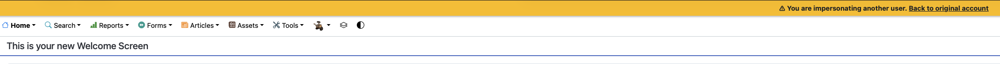
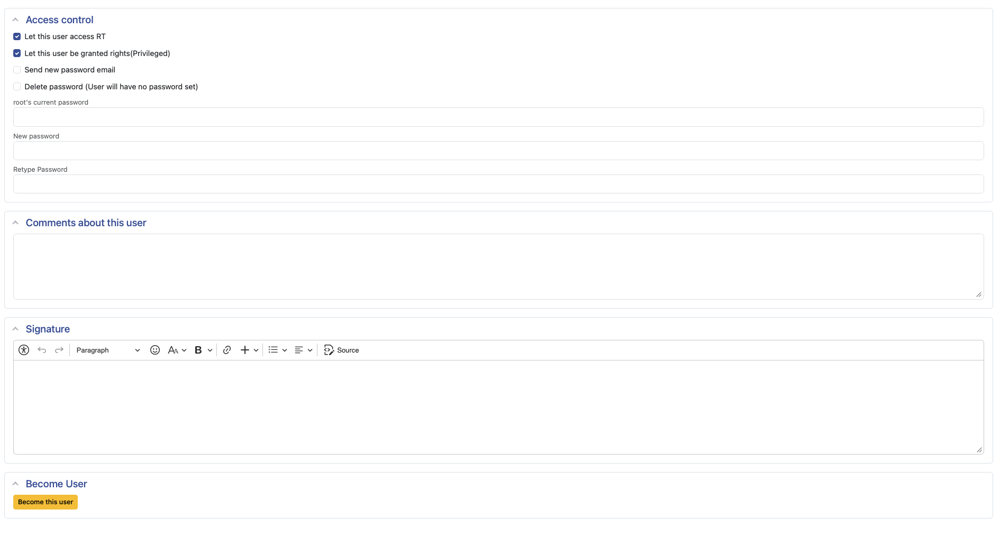

# RT-Extension-BecomeUser

Impersonate any non-SuperUser directly from the RT admin interface — useful for support and debugging. A persistent warning banner reminds you that you are acting as another user, and one click brings you back to your own account.

---

## Screenshots

**Warning banner and navigation while impersonating**



**"Become User" button on the user admin page**



---

## Features

- **One-click impersonation** from Admin → Users → (select user) or from the User Summary page
- **Persistent warning banner** fixed at the top of every page, with a direct link back to your original account
- **Safe by design** — SuperUsers can never be impersonated
- **Granular access control** via the dedicated `BecomeUser` right (no SuperUser required)
- **Full RT 6 compatibility** — HTMX navigation, Bootstrap 5 styling, DB-backed session persistence

---

## Requirements

| Requirement | Version |
|---|---|
| Request Tracker | 6.0.0 – 6.x |
| Perl | 5.10+ |

---

## Installation

```bash
perl Makefile.PL
make
sudo make install
```

Then enable the plugin in your RT configuration (`etc/RT_SiteConfig.pm` or a file in `etc/RT_SiteConfig.d/`):

```perl
Plugin('RT::Extension::BecomeUser');
```

After installation, clear the Mason cache and restart your web server:

```bash
sudo rm -rf /opt/rt6/var/mason_data/obj
sudo systemctl restart apache2
```

---

## Configuration

No additional configuration is required. After enabling the plugin, grant the `BecomeUser` right to the users or groups who should be allowed to impersonate others:

**Admin → Global → Group Rights → (select group) → System → Become other users**

> **Security note:** The `BecomeUser` right allows the holder to impersonate *any* non-SuperUser. Grant it only to trusted administrators.

---

## Usage

1. Navigate to **Admin → Users** and open any non-SuperUser.
2. Scroll to the **Become User** section at the bottom of the page and click **Become this user**.
3. You are now acting as that user. The yellow warning banner at the top of every page reminds you of the active impersonation.
4. Click **Back to original account** in the banner to return to your own session.

Alternatively, the **Become User** button also appears on the **User Summary** page.

---

## Access Control

The extension registers a new right:

| Right | Description |
|---|---|
| `BecomeUser` | Allows impersonating any non-SuperUser |

Users with the `SuperUser` right can also use this feature. SuperUsers themselves can never be impersonated.

---

## License

This software is free software; you can redistribute it and/or modify it under the terms of the **GNU General Public License, version 2** (GPL-2.0).

## Authors

- **Matthias Bloch** &lt;matthias.bloch@puffin.ch&gt; — original implementation
- **Misy1337** — updates and improvements
- **Torsten Brumm** — RT 6 port
